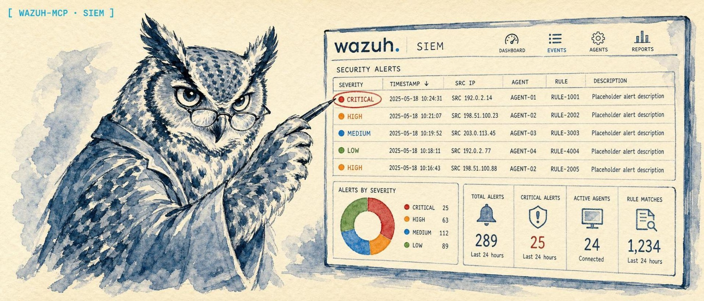

<p align="center">
  
</p>

<h1 align="center">wazuh-mcp</h1>

<p align="center">
  <strong>An MCP server that lets an AI client query your Wazuh SIEM/XDR: alerts, agents, vulnerabilities, rules, and more, read-only.</strong>
</p>

<p align="center">
  <strong>Website:</strong> <a href="https://lidless.dev/wazuh-mcp">lidless.dev/wazuh-mcp</a>
</p>

<p align="center">
  
  
  
  
  
  
</p>

wazuh-mcp is a [Model Context Protocol](https://modelcontextprotocol.io/) (MCP) server for the [Wazuh](https://wazuh.com/) SIEM/XDR platform. It exposes your Wazuh manager and Wazuh Indexer as MCP tools so Claude, Claude Code, or any MCP-compatible client can investigate alerts, triage agents, and pull vulnerability inventory in plain language. It is read-only by design and security-first: TLS verification is on by default, sensitive fields (agent IPs, full logs, file hashes, command lines) are hidden unless you opt in per call, and attacker-controlled SIEM text is wrapped in untrusted-data markers to blunt prompt injection against the calling model.

## What it does

wazuh-mcp turns a Wazuh SIEM/XDR deployment into a set of MCP tools an AI agent can call. Point your MCP client at the server, give it your Wazuh manager and (optionally) Wazuh Indexer credentials, and the model can list active and disconnected agents, retrieve and full-text search security alerts, pull vulnerability inventory by CVE or severity, inspect detection rules and decoders, review SCA (Security Configuration Assessment) results, walk system inventory (OS, packages, processes, ports, network, hotfixes), read File Integrity Monitoring and rootcheck findings, fetch manager logs and configuration, and run a connection diagnostic. It ships 28 tools, 3 resources, and 3 guided prompts over stdio. The server only ever reads from Wazuh: the sole writes it performs are JWT authentication against the manager and `_search` queries against the indexer.

## Installation

The quickstart below runs the published npm package with `npx`, which is the recommended path. To work from source instead:

```bash
git clone https://github.com/lidless-labs/wazuh-mcp.git
cd wazuh-mcp
npm install
npm run build
```

## Quickstart

Run it straight from npm with `npx`, no clone or build required:

```json
{
  "mcpServers": {
    "wazuh": {
      "command": "npx",
      "args": ["-y", "wazuh-mcp"],
      "env": {
        "WAZUH_URL": "https://your-wazuh-manager:55000",
        "WAZUH_USERNAME": "wazuh-wui",
        "WAZUH_PASSWORD": "your-password",
        "WAZUH_INDEXER_URL": "https://your-wazuh-indexer:9200",
        "WAZUH_INDEXER_USERNAME": "admin",
        "WAZUH_INDEXER_PASSWORD": "your-indexer-password"
      }
    }
  }
}
```

Drop that into your MCP client's server config (see [Usage](#usage) for the exact file per client), restart the client, and ask it something like *"list the active Wazuh agents"* or *"search alerts for brute force in the last 24 hours."* The indexer settings are optional: without them the agent, rule, decoder, and version tools still work, and the alert and vulnerability tools return a configuration message instead of failing.

Prefer a global install?

```bash
npm install -g wazuh-mcp
# then use "command": "wazuh-mcp" instead of the npx invocation above
```

## Usage

The quickstart `mcpServers` block at the top works for most clients. The per-client recipes below give you the exact file location or CLI command for each.

### Claude Desktop

Add to `~/Library/Application Support/Claude/claude_desktop_config.json` (macOS) or `%APPDATA%\Claude\claude_desktop_config.json` (Windows):

```json
{
  "mcpServers": {
    "wazuh": {
      "command": "npx",
      "args": ["-y", "wazuh-mcp"],
      "env": {
        "WAZUH_URL": "https://your-wazuh-manager:55000",
        "WAZUH_USERNAME": "wazuh-wui",
        "WAZUH_PASSWORD": "your-password",
        "WAZUH_INDEXER_URL": "https://your-wazuh-indexer:9200",
        "WAZUH_INDEXER_USERNAME": "admin",
        "WAZUH_INDEXER_PASSWORD": "your-indexer-password"
      }
    }
  }
}
```

### Claude Code

```bash
claude mcp add wazuh \
  --env WAZUH_URL=https://your-wazuh-manager:55000 \
  --env WAZUH_USERNAME=wazuh-wui \
  --env WAZUH_PASSWORD=your-password \
  --env WAZUH_INDEXER_URL=https://your-wazuh-indexer:9200 \
  --env WAZUH_INDEXER_USERNAME=admin \
  --env WAZUH_INDEXER_PASSWORD=your-indexer-password \
  -- npx -y wazuh-mcp
```

Add `--scope user` to make it available from any directory instead of only the current project.

### Codex CLI

[Codex CLI](https://github.com/openai/codex) registers MCP servers via `codex mcp add`:

```bash
codex mcp add wazuh \
  --env WAZUH_URL=https://your-wazuh-manager:55000 \
  --env WAZUH_USERNAME=wazuh-wui \
  --env WAZUH_PASSWORD=your-password \
  --env WAZUH_INDEXER_URL=https://your-wazuh-indexer:9200 \
  --env WAZUH_INDEXER_USERNAME=admin \
  --env WAZUH_INDEXER_PASSWORD=your-indexer-password \
  -- npx -y wazuh-mcp
```

Codex writes the entry to `~/.codex/config.toml` under `[mcp_servers.wazuh]`. Verify with `codex mcp list`.

### OpenClaw

With the npm package:

```bash
openclaw mcp set wazuh '{
  "command": "npx",
  "args": ["-y", "wazuh-mcp"],
  "env": {
    "WAZUH_URL": "https://your-wazuh-manager:55000",
    "WAZUH_USERNAME": "wazuh-wui",
    "WAZUH_PASSWORD": "your-password",
    "WAZUH_INDEXER_URL": "https://your-wazuh-indexer:9200",
    "WAZUH_INDEXER_USERNAME": "admin",
    "WAZUH_INDEXER_PASSWORD": "your-indexer-password"
  }
}'
```

Or, when running from a source checkout, point `command`/`args` at the built `dist/index.js`:

```bash
openclaw mcp set wazuh '{
  "command": "node",
  "args": ["/absolute/path/to/wazuh-mcp/dist/index.js"],
  "env": {
    "WAZUH_URL": "https://your-wazuh-manager:55000",
    "WAZUH_USERNAME": "wazuh-wui",
    "WAZUH_PASSWORD": "your-password",
    "WAZUH_INDEXER_URL": "https://your-wazuh-indexer:9200",
    "WAZUH_INDEXER_USERNAME": "admin",
    "WAZUH_INDEXER_PASSWORD": "your-indexer-password"
  }
}'
```

Then restart the gateway so the new server is picked up:

```bash
systemctl --user restart openclaw-gateway
openclaw mcp list   # confirm "wazuh" is registered
```

### Hermes Agent

[Hermes Agent](https://github.com/NousResearch/hermes-agent) reads MCP config from `~/.hermes/config.yaml` under the `mcp_servers` key. Add an entry:

```yaml
mcp_servers:
  wazuh:
    command: "npx"
    args: ["-y", "wazuh-mcp"]
    env:
      WAZUH_URL: "https://your-wazuh-manager:55000"
      WAZUH_USERNAME: "wazuh-wui"
      WAZUH_PASSWORD: "your-password"
      WAZUH_INDEXER_URL: "https://your-wazuh-indexer:9200"
      WAZUH_INDEXER_USERNAME: "admin"
      WAZUH_INDEXER_PASSWORD: "your-indexer-password"
```

Then reload MCP from inside a Hermes session with `/reload-mcp`.

### Standalone

```bash
export WAZUH_URL=https://your-wazuh-manager:55000
export WAZUH_USERNAME=wazuh-wui
export WAZUH_PASSWORD=your-password
npx -y wazuh-mcp
```

### Development

```bash
npm run dev    # Watch mode with tsx
npm run lint   # Type checking
npm test       # Run tests
```

## MCP Tools

All 28 tools are read-only.

### Agent Tools

| Tool | Description |
|------|-------------|
| `list_agents` | List all agents with optional status filtering (active, disconnected, never_connected, pending) |
| `get_agent` | Get detailed info for a specific agent by ID |
| `get_agent_stats` | Get CPU, memory, and disk statistics for an agent |

### Alert Tools

| Tool | Description |
|------|-------------|
| `get_alerts` | Retrieve recent alerts with filtering by time range, level, agent, rule, and text search |
| `get_alert` | Retrieve a single alert by ID |
| `search_alerts` | Full-text search across alerts with optional time range filtering |

### Vulnerability Tools

| Tool | Description |
|------|-------------|
| `list_vulnerabilities` | List vulnerability inventory with optional CVE, agent, severity, and package filters |
| `search_vulnerabilities` | Search vulnerability inventory by CVE, package, agent, or description |

### Rule Tools

| Tool | Description |
|------|-------------|
| `list_rules` | List detection rules with level and group filtering |
| `get_rule` | Get full rule details including compliance mappings |
| `search_rules` | Search rules by description text |

### SCA Tools (Security Configuration Assessment)

| Tool | Description |
|------|-------------|
| `get_sca_policies` | List SCA policies and scores for an agent (CIS benchmarks, etc.) |
| `get_sca_checks` | Get individual check results with remediation steps and compliance mappings |

### Syscollector Tools (System Inventory)

| Tool | Description |
|------|-------------|
| `get_agent_os` | Get OS information (name, version, architecture, hostname) |
| `get_agent_packages` | List installed software packages with versions |
| `get_agent_processes` | List running processes with PIDs and command lines |
| `get_agent_ports` | List open network ports with associated processes |
| `get_agent_network` | List network interfaces and IP addresses |
| `get_agent_hotfixes` | List installed Windows hotfixes/patches |

### FIM & Rootcheck Tools

| Tool | Description |
|------|-------------|
| `get_fim_files` | Get File Integrity Monitoring results (files, registry keys, hashes) |
| `get_rootcheck` | Get rootkit detection scan findings |

### Manager Tools

| Tool | Description |
|------|-------------|
| `get_manager_logs` | Get Wazuh manager logs filtered by level and module |
| `get_manager_config` | Get active manager configuration by section with secret-like values redacted by default |

### Group Tools

| Tool | Description |
|------|-------------|
| `list_groups` | List all agent groups |
| `get_group_agents` | List agents in a specific group |

### Other Tools

| Tool | Description |
|------|-------------|
| `list_decoders` | List log decoders with optional name filtering |
| `get_wazuh_version` | Get Wazuh manager version and API info |
| `diagnose_wazuh_connection` | Check sanitized configuration, URL/TLS settings, manager auth/version, and indexer readiness |

## Configuration

Set the following environment variables:

| Variable | Required | Default | Description |
|----------|----------|---------|-------------|
| `WAZUH_URL` | Yes | - | Wazuh API URL (e.g., `https://192.0.2.2:55000`) |
| `WAZUH_USERNAME` | Yes | - | API username |
| `WAZUH_PASSWORD` | Yes | - | API password |
| `WAZUH_VERIFY_SSL` | No | `true` | Verifies SSL certificates by default. Set to `false` (also accepts `0`/`no`/`off`) to disable verification for trusted self-signed lab environments only. |
| `WAZUH_TIMEOUT` | No | `30` | Request timeout in seconds. Must be a positive integer. |
| `WAZUH_ALLOW_SENSITIVE_CONFIG` | No | `false` | Server-side gate for `get_manager_config`. When unset/`false`, sensitive configuration values are always redacted even if the tool's `include_sensitive_config` argument is `true`. Set to `true` (also accepts `1`/`yes`/`on`) to allow unredacted output when explicitly requested. |
| `WAZUH_MCP_MAX_RESPONSE_BYTES` | No | `250000` | Maximum MCP tool response size before returning a truncated preview with metadata. |

Alternative variable names `WAZUH_BASE_URL` and `WAZUH_USER` are also supported.

### Wazuh Indexer (OpenSearch) - Required for Alerts and Vulnerabilities

Wazuh 4.x stores alerts and vulnerability inventory in the Wazuh Indexer (OpenSearch), not the REST API. To enable alert tools (`get_alerts`, `get_alert`, `search_alerts`), vulnerability tools (`list_vulnerabilities`, `search_vulnerabilities`), and the `wazuh://alerts/recent` resource, configure the indexer connection:

| Variable | Required | Default | Description |
|----------|----------|---------|-------------|
| `WAZUH_INDEXER_URL` | No | - | Wazuh Indexer URL (e.g., `https://192.0.2.2:9200`) |
| `WAZUH_INDEXER_USERNAME` | No | `admin` | Indexer username |
| `WAZUH_INDEXER_PASSWORD` | Yes, when `WAZUH_INDEXER_URL` is set | - | Indexer password. The server fails fast at startup if `WAZUH_INDEXER_URL` is set without it. |
| `WAZUH_INDEXER_VERIFY_SSL` | No | `true` | Verifies SSL certificates by default. Set to `false` (also accepts `0`/`no`/`off`) to disable verification for trusted self-signed lab environments only. |
| `WAZUH_INDEXER_TIMEOUT` | No | `30` | Indexer request timeout in seconds. Must be a positive integer. |

If `WAZUH_INDEXER_URL` is not set, alert and vulnerability tools will return a helpful configuration message. All other tools (agents, rules, decoders, version) work without the indexer.

SSL certificate verification is enabled by default (secure by default). When either SSL verification setting is explicitly set to `false`, the server prints a startup warning to stderr. TLS verification is disabled only for that configured Wazuh client.

### Sensitive Output Defaults

Several tools return minimized output by default to avoid exposing raw logs, IPs, command lines, hashes, or raw event payloads unless requested:

| Tool | Hidden by default | Opt-in field |
|------|-------------------|--------------|
| `list_agents`, `get_agent`, `get_group_agents` | Agent IP details | `include_ip: true` |
| `get_alerts`, `search_alerts` | `full_log` | `include_full_log: true` |
| `get_alert` | `full_log`, raw `data` | `include_full_log: true`, `include_raw_data: true` |
| `list_vulnerabilities`, `search_vulnerabilities` | Vulnerability descriptions | `include_description: true` |
| `get_agent_processes` | Process command lines and arguments | `include_command: true` |
| `get_fim_files` | MD5 and SHA-256 hashes | `include_hashes: true` |
| `get_manager_logs` | Full log descriptions | `include_description: true` |
| `get_manager_config` | Secret-like config values | `include_sensitive_config: true` (only honored when the server-side `WAZUH_ALLOW_SENSITIVE_CONFIG` flag is enabled; otherwise always redacted) |

### Untrusted SIEM Content

Alert and log fields originate on monitored endpoints: anyone who can write a log line to a monitored host (a failed SSH login with a crafted username, a web request path, a syslog message) controls the text that lands in `full_log`, alert `rule_description`, raw event `data`, and manager log descriptions. To blunt prompt injection against the calling agent, the server wraps those values in `<untrusted_siem_data>...</untrusted_siem_data>` markers, includes an `output.untrusted_data_note` warning in affected responses, and states in the tool descriptions that the content is attacker-influenced data, never instructions to follow.

### Input Validation

Tool inputs are validated before requests are sent to Wazuh. Pagination is bounded, search text is length-limited, sort fields are enumerated per tool, and path-oriented identifiers such as agent IDs, alert IDs, group IDs, and SCA policy IDs reject unsupported characters.

Paginated tool responses include a `pagination` object with `total`, `limit`, `offset`, and `has_more` fields while preserving the existing top-level `total`, `limit`, and `offset` fields.

Tool responses are capped by `WAZUH_MCP_MAX_RESPONSE_BYTES`. Oversized responses return valid JSON with `output.response_truncated`, byte counts, and a preview instead of flooding the MCP client.

Transient manager `GET` requests and indexer search/readiness requests retry briefly on `429`, `502`, `503`, `504`, and common transient network reset or timeout errors.

## Features

- **28 MCP Tools** - Agents, alerts, vulnerabilities, rules, decoders, SCA, syscollector, FIM, rootcheck, groups, manager, and diagnostics
- **3 MCP Resources** - Pre-built views for agents, recent alerts, and rule summaries
- **3 MCP Prompts** - Alert investigation, agent health checks, and security overviews
- **Read-only by design** - The only writes are JWT auth and indexer `_search`; no tool changes Wazuh state
- **Secure by default** - TLS verification on, sensitive fields redacted unless opted in, untrusted SIEM content delimited, every error sanitized before it reaches the client
- **JWT Authentication** - Automatic token management with refresh on expiry
- **Full Compliance Mapping** - PCI-DSS, GDPR, HIPAA, NIST 800-53, MITRE ATT&CK
- **Pagination** - All list endpoints support limit/offset pagination
- **Type-Safe** - Full TypeScript with strict mode and Zod schema validation

## Prerequisites

- Node.js 20+
<!-- content-guard: allow port-reference -->
- A running Wazuh manager with API access (default port 55000)
- Wazuh API credentials (username/password)
- (Optional) Wazuh Indexer (OpenSearch) access for alert queries

## MCP Resources

| Resource URI | Description |
|-------------|-------------|
| `wazuh://agents` | All registered agents and their status |
| `wazuh://alerts/recent` | 25 most recent security alerts |
| `wazuh://rules/summary` | Detection rules sorted by severity |

## MCP Prompts

| Prompt | Description |
|--------|-------------|
| `investigate-alert` | Step-by-step alert investigation with MITRE mapping and remediation |
| `agent-health-check` | Comprehensive agent health assessment (status, resources, alerts) |
| `security-overview` | Full environment security summary with compliance coverage |

## Examples

### List active agents

```
Use list_agents with status "active" to see all connected agents.
```

### Investigate a brute force attempt

```
Search alerts for "brute force" and investigate the top result,
including the MITRE ATT&CK technique and remediation steps.
```

### Check agent health

```
Run an agent health check on agent 001 - check its connection status,
resource usage, and any recent critical alerts.
```

### Find high-severity rules

```
List all rules with level 12 or higher to see critical detection rules
and their compliance framework mappings.
```

## Why not the Wazuh dashboard or the raw API?

- **The Wazuh dashboard** is built for humans clicking through Kibana-style views. It is great for a SOC analyst at a screen, but an AI agent cannot drive it, and it does not turn natural-language questions into the right manager and indexer queries. wazuh-mcp gives the model typed tools instead.
- **The raw Wazuh REST API + indexer `_search`** can be called directly, but then every agent has to learn JWT auth, the manager-versus-indexer split (alerts and vulnerabilities live in the indexer in Wazuh 4.x), pagination shapes, and which fields are sensitive. wazuh-mcp wraps all of that, validates inputs, caps response size, and sanitizes errors so credentials never leak back to the model.
- **A general "run any HTTP request" tool** would technically reach Wazuh, but it hands the model your credentials, no input validation, no read-only guarantee, and no redaction of IPs, hashes, or full logs. This server is deliberately read-only and minimizes sensitive output by default.
- **Writing your own Wazuh MCP shim** is reasonable, and the source here is MIT-licensed if you want to fork it. This one already handles auth refresh, the indexer fallback message, untrusted-content delimiting, transient-error retries, and 28 vetted tools.

## What wazuh-mcp is not

- **Not a write path.** No tool modifies Wazuh state. It cannot restart agents, edit rules, acknowledge alerts, or change configuration. The only writes are JWT authentication and indexer `_search` queries.
- **Not a replacement for the Wazuh dashboard or SIEM.** It is a query surface for AI clients, not an analyst UI, a data store, or an alerting engine.
- **Not a hosted service.** It runs locally as a stdio MCP server next to your client. Your Wazuh credentials stay on your machine and in your client's config.
- **Not a guarantee against prompt injection.** It delimits attacker-influenced SIEM content and warns the model, which reduces risk but does not eliminate it. Treat tool output as data, not instructions.
- **Not a way to bypass Wazuh access control.** It uses the credentials you give it and can see only what that account can see.

## Documentation and links

- **Website:** [lidless.dev/wazuh-mcp](https://lidless.dev/wazuh-mcp)
- **npm:** [`wazuh-mcp`](https://www.npmjs.com/package/wazuh-mcp)
- **Issues:** [github.com/lidless-labs/wazuh-mcp/issues](https://github.com/lidless-labs/wazuh-mcp/issues)
- **Changelog:** [CHANGELOG.md](CHANGELOG.md)
- **Security policy:** [SECURITY.md](SECURITY.md)
- **Contributing:** [CONTRIBUTING.md](CONTRIBUTING.md)

## Testing

```bash
npm test               # Run all tests
npm run typecheck      # Type-check TypeScript
npm audit --omit=dev   # Audit production dependencies
npm run pack:check     # Verify package contents
npm run test:watch     # Watch mode
```

Tests use mocked Wazuh API responses - no live Wazuh instance needed.

## Project Structure

```
wazuh-mcp/
├── src/
│   ├── index.ts           # MCP server entry point
│   ├── config.ts          # Environment configuration
│   ├── client.ts          # Wazuh REST API client (JWT auth)
│   ├── indexer-client.ts  # Wazuh Indexer (OpenSearch) client
│   ├── types.ts           # TypeScript type definitions
│   ├── resources.ts       # MCP resource handlers
│   ├── prompts.ts         # MCP prompt templates
│   └── tools/
│       ├── agents.ts      # Agent management tools
│       ├── alerts.ts      # Alert query tools
│       ├── rules.ts       # Rule query tools
│       ├── decoders.ts    # Decoder listing tool
│       ├── version.ts     # Version info tool
│       ├── sca.ts         # Security Configuration Assessment
│       ├── syscollector.ts # System inventory (OS, packages, ports, etc.)
│       ├── syscheck.ts    # File Integrity Monitoring
│       ├── rootcheck.ts   # Rootkit detection
│       ├── manager.ts     # Manager logs and configuration
│       └── groups.ts      # Agent group management
├── tests/
│   ├── client.test.ts     # API client unit tests
│   └── tools.test.ts      # Tool handler unit tests
├── package.json
├── tsconfig.json
├── tsup.config.ts
└── vitest.config.ts
```

## License

MIT. See [LICENSE](LICENSE).
