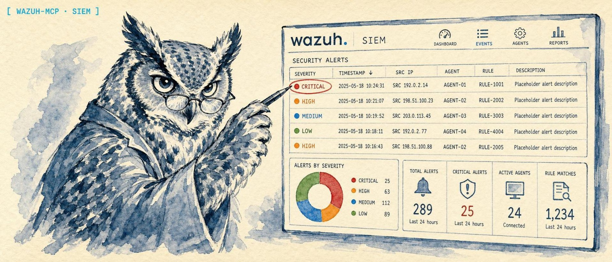

<p align="center">
  
</p>

<p align="center">
  <a href="https://lidless.dev"></a>
</p>

<h1 align="center">wazuh-mcp</h1>

<p align="center">
  <strong>A read-only Wazuh SIEM/XDR control CLI and MCP adapter for alerts, agents, vulnerabilities, rules, and more.</strong>
</p>

<p align="center">
  <strong>Website:</strong> <a href="https://lidless.dev/wazuh-mcp">lidless.dev/wazuh-mcp</a>
</p>

<p align="center">
  
  
  
  
  
  
</p>

wazuhctrl is a read-only control CLI for the [Wazuh](https://wazuh.com/) SIEM/XDR platform. The same package ships `wazuh-mcp`, a [Model Context Protocol](https://modelcontextprotocol.io/) (MCP) adapter that exposes your Wazuh manager and Wazuh Indexer as MCP tools so Claude, Claude Code, or any MCP-compatible client can investigate alerts, triage agents, and pull vulnerability inventory in plain language. It is read-only by design and security-first: TLS verification is on by default, sensitive fields (agent IPs, full logs, file hashes, command lines) are hidden unless you opt in per call, and attacker-controlled SIEM text is wrapped in untrusted-data markers to blunt prompt injection against the calling model.

## What it does

wazuhctrl and wazuh-mcp turn a Wazuh SIEM/XDR deployment into typed operator surfaces. Point your MCP client at the server, give it your Wazuh manager and (optionally) Wazuh Indexer credentials, and the model can list active and disconnected agents, retrieve and full-text search security alerts, pull vulnerability inventory by CVE or severity, inspect detection rules and decoders, review SCA (Security Configuration Assessment) results, walk system inventory (OS, packages, processes, ports, network, hotfixes), read File Integrity Monitoring and rootcheck findings, fetch manager logs and configuration, and run a connection diagnostic. The CLI starts with status, agent inventory, and diagnostics for shells, cron, and CI. The package ships 28 MCP tools, 3 resources, and 3 guided prompts over stdio. Both surfaces only read from Wazuh: the sole writes they perform are JWT authentication against the manager and `_search` queries against the indexer.

## Installation

The quickstart below runs the published npm package with `npx`, which is the recommended path. To work from source instead:

```bash
git clone https://github.com/lidless-labs/wazuh-mcp.git
cd wazuh-mcp
npm install
npm run build
```

## Quickstart

The quickstart runs the published npm package with `npx` under two dedicated accounts: a Wazuh API user with the built-in `readonly` role and a Wazuh Indexer user whose custom role reads only the alert and vulnerability indices. Create both with [Least-privilege setup](#least-privilege-setup) first. Do not point the server at the `wazuh-wui` API administrator or the indexer `admin` superuser.

Put the settings in a file that only you can read:

```bash
mkdir -p -m 700 ~/.config/wazuh-mcp
touch ~/.config/wazuh-mcp/env
chmod 600 ~/.config/wazuh-mcp/env
```

Then fill it in with your editor:

```bash
WAZUH_URL=https://your-wazuh-manager:55000
WAZUH_USERNAME=wazuh-mcp-api
WAZUH_PASSWORD='the-api-user-password'
WAZUH_CA_FILE=/path/to/root-ca.pem
WAZUH_INDEXER_URL=https://your-wazuh-indexer:9200
WAZUH_INDEXER_USERNAME=wazuh-mcp-indexer
WAZUH_INDEXER_PASSWORD='the-indexer-user-password'
WAZUH_INDEXER_CA_FILE=/path/to/root-ca.pem
```

The wrapper below reads this file as shell code, so keep each password in single quotes. Write a single quote inside a password as `'\''`, or choose a password without one.

To run without the indexer, leave out all four `WAZUH_INDEXER_*` lines. The agent, rule, decoder, and version tools still work, and the alert and vulnerability tools return a configuration message instead of failing. If you keep `WAZUH_INDEXER_URL`, you also need `WAZUH_INDEXER_USERNAME` and `WAZUH_INDEXER_PASSWORD`, or the server stops at startup. `WAZUH_INDEXER_CA_FILE` stays optional. [TLS verification](#tls-verification) explains which CA file to use.

Save this wrapper as `~/.local/bin/wazuh-mcp-env`. It loads the file and then runs the command that follows it, so no password appears in client config:

```bash
mkdir -p ~/.local/bin
cat > ~/.local/bin/wazuh-mcp-env <<'EOF'
#!/bin/sh
# Load wazuh-mcp settings from a 0600 file, then run the given command.
set -eu
set -a
. "${WAZUH_MCP_ENV_FILE:-$HOME/.config/wazuh-mcp/env}"
set +a
exec "$@"
EOF
chmod 755 ~/.local/bin/wazuh-mcp-env
```

Check both logins, TLS, and the indexer role from a shell before you wire up a client:

```bash
~/.local/bin/wazuh-mcp-env npx -y --package wazuh-mcp wazuhctrl diagnostics
```

It prints `diagnostics status=` and one line per check, and it exits 1 when a check reports an error. It does not check the API user's role, because logging in and reading the API version need no permission. wazuh-mcp 2.0.0 and earlier print nothing and exit 0 here because of a bin-symlink bug (see the [CHANGELOG](CHANGELOG.md)), so no output means the check did not run. In that case, wire up the client and ask it to run `diagnose_wazuh_connection`, which runs the same checks.

Then register the wrapper as the server command. Most MCP clients start the command without a shell, so use the full path to the wrapper instead of `~`:

```json
{
  "mcpServers": {
    "wazuh": {
      "command": "/absolute/path/to/wazuh-mcp-env",
      "args": ["npx", "-y", "wazuh-mcp"]
    }
  }
}
```

Drop that into your MCP client's server config (see [Usage](#usage) for the exact file per client), restart the client, and ask it something like *"list the active Wazuh agents"* or *"search alerts for brute force in the last 24 hours."* If your client expands environment variables in its config, you can reference variables from the client's own environment instead of using the wrapper. On macOS and Linux, never paste a literal password into client config. The wrapper does not run on Windows, and [Usage](#usage) covers that case.

Prefer a global install?

```bash
npm install -g wazuh-mcp
```

Then use `"args": ["wazuh-mcp"]` instead of the npx invocation above.

## Least-privilege setup

wazuh-mcp only reads, so neither account needs write or administrator rights. The permissions below were checked against Wazuh 4.14.8: the `readonly` API role covered every manager tool, and the indexer role covered the alert and vulnerability tools plus both index checks in `diagnose_wazuh_connection`. The commands run once as an administrator, need `curl` and `jq`, and read passwords with `read -rs` (bash or zsh) so they stay out of shell history. The administrator password passed to `curl -u` and the API token passed with `-H` can still appear briefly in the process list, so run the commands on a host where no other user can see your processes.

### TLS verification

Keep `WAZUH_VERIFY_SSL` and `WAZUH_INDEXER_VERIFY_SSL` at their default of `true`. Instead of turning verification off, point `WAZUH_CA_FILE` and `WAZUH_INDEXER_CA_FILE` at the root CA that signed your Wazuh certificates. On the Docker deployment that file is `wazuh-docker/single-node/config/wazuh_indexer_ssl_certs/root-ca.pem` (`multi-node/` for a cluster). The host in each URL must be a name or address listed in that service's certificate. The single-node Docker certificates are issued for `wazuh.indexer` and `wazuh.manager`, so either reach the services by those names, for example through `/etc/hosts` entries, or regenerate the certificates with your host names in `config/certs.yml`.

On a Linux host, Docker creates that directory as root, and the certificate generator sets it to mode 0500 and the files in it to 0400. Only root can read the files from the host, even if your account has user ID 1000, which owns most of them. Copy the CA to a file you own, and use the copy for both settings and for `CA_FILE` in the setup commands below:

```bash
mkdir -p -m 700 ~/.config/wazuh-mcp
sudo cat wazuh-docker/single-node/config/wazuh_indexer_ssl_certs/root-ca.pem > ~/.config/wazuh-mcp/root-ca.pem
```

<!-- content-guard: allow localhost-bare -->
On the Docker deployment the indexer certificate is already signed by that CA. The manager API certificate is not: unless you supply one, the API generates a self-signed certificate for `localhost` at startup, and that certificate fails verification against `root-ca.pem`. Replace it with a certificate signed by the root CA, saved as `server.crt` and `server.key` in the manager's `/var/ossec/api/configuration/ssl/`, and restart the manager. The same `root-ca.pem` then works for `WAZUH_CA_FILE`. The setup commands below verify TLS the same way, so do this step first.

On single-node Docker, the certificate generator already created a manager certificate signed by the root CA, `wazuh.manager.pem` and its key `wazuh.manager-key.pem`, and the manager container mounts them as `/etc/ssl/filebeat.pem` and `/etc/ssl/filebeat.key`. The API directory is on a Docker volume inside the container, so copy them there and restart the Wazuh daemons inside the container, from `wazuh-docker/single-node`:

```bash
docker compose exec wazuh.manager sh -c 'cp /etc/ssl/filebeat.pem /var/ossec/api/configuration/ssl/server.crt && cp /etc/ssl/filebeat.key /var/ossec/api/configuration/ssl/server.key'
docker compose exec wazuh.manager /var/ossec/bin/wazuh-control restart
```

The API makes the `wazuh` user the owner of both files when it starts, and the copies stay on the volume across restarts.

On a package install, the root CA is `/etc/filebeat/certs/root-ca.pem` on the server node, and `filebeat.pem` and `filebeat-key.pem` in that directory are a server certificate signed by it. That directory is readable only by root, so copy those files with `sudo`.

### Wazuh API user with the `readonly` role

The built-in `readonly` role reads agents, groups, rules, decoders, SCA, FIM, rootcheck, syscollector inventory, and manager and cluster status, configuration, and logs. That covers every manager tool. It also reads CDB lists, CIS-CAT results, MITRE data, and the API configuration, which no tool uses, and it changes nothing. It has no `security:*` permissions, so it cannot read or change other users, roles, policies, or the security configuration. Like every API user, it can still read its own account and policies at `/security/users/me` and `/security/users/me/policies`. New API users start with `allow_run_as` disabled, which is what this server needs. Sign in once as an existing API administrator (`wazuh` or `wazuh-wui`) to create the user:

```bash
WAZUH_URL=https://your-wazuh-manager:55000
CA_FILE=/path/to/root-ca.pem
API_ADMIN=wazuh-wui

printf 'Password for %s: ' "$API_ADMIN"; read -rs API_ADMIN_PASSWORD; echo
printf 'Password for the new wazuh-mcp-api user: '; read -rs NEW_PASSWORD; echo
export NEW_PASSWORD

TOKEN=$(curl -sS --cacert "$CA_FILE" -u "$API_ADMIN:$API_ADMIN_PASSWORD" \
  -X POST "$WAZUH_URL/security/user/authenticate?raw=true")

USER_ID=$(jq -n '{username: "wazuh-mcp-api", password: env.NEW_PASSWORD}' |
  curl -sS --cacert "$CA_FILE" -X POST "$WAZUH_URL/security/users" \
    -H "Authorization: Bearer $TOKEN" -H "Content-Type: application/json" --data-binary @- |
  jq -r '.data.affected_items[0].id')

ROLE_ID=$(curl -sS --cacert "$CA_FILE" "$WAZUH_URL/security/roles" \
    -H "Authorization: Bearer $TOKEN" |
  jq -r '.data.affected_items[] | select(.name == "readonly") | .id')

echo "user id: $USER_ID, readonly role id: $ROLE_ID"

curl -sS --cacert "$CA_FILE" -X POST \
  "$WAZUH_URL/security/users/$USER_ID/roles?role_ids=$ROLE_ID" \
  -H "Authorization: Bearer $TOKEN"

unset API_ADMIN_PASSWORD NEW_PASSWORD TOKEN
```

Both IDs must be numbers. If the user ID prints as `null`, run the `POST /security/users` request again without the final `jq` to see the API message. The usual causes are a password that breaks the rules (8 to 64 characters with an uppercase letter, a lowercase letter, a number, and a symbol), a `wazuh-mcp-api` user left over from an earlier run, or a wrong administrator password. The last request answers with `All roles were linked to user wazuh-mcp-api`.

### Wazuh Indexer user and role

The server sends `GET /` for cluster info, which needs the cluster permission `cluster:monitor/main`. Its `HEAD` index checks and `_search` queries go to `wazuh-alerts-*` and `wazuh-states-vulnerabilities*`. The vulnerability indices themselves are named `wazuh-states-vulnerabilities-` plus a suffix, so the role pattern below covers them. The role is read-only and limited to those two index families. Wazuh's documented read-only recipe (`cluster_composite_ops_ro` plus `read` on `*`) can search, but it gets HTTP 403 on both index checks in `diagnose_wazuh_connection` and can read every index. These commands use the indexer security REST API as the `admin` user:

```bash
INDEXER_URL=https://your-wazuh-indexer:9200
CA_FILE=/path/to/root-ca.pem

printf 'Password for the indexer admin user: '; read -rs INDEXER_ADMIN_PASSWORD; echo
printf 'Password for the new wazuh-mcp-indexer user: '; read -rs NEW_PASSWORD; echo
export NEW_PASSWORD

curl -sS --cacert "$CA_FILE" -u "admin:$INDEXER_ADMIN_PASSWORD" -X PUT \
  "$INDEXER_URL/_plugins/_security/api/roles/wazuh_mcp_read" \
  -H "Content-Type: application/json" -d '{
    "cluster_permissions": ["cluster:monitor/main"],
    "index_permissions": [{
      "index_patterns": ["wazuh-alerts-*", "wazuh-states-vulnerabilities-*"],
      "allowed_actions": ["read", "indices:admin/get"]
    }]
  }'

jq -n '{password: env.NEW_PASSWORD}' |
  curl -sS --cacert "$CA_FILE" -u "admin:$INDEXER_ADMIN_PASSWORD" -X PUT \
    "$INDEXER_URL/_plugins/_security/api/internalusers/wazuh-mcp-indexer" \
    -H "Content-Type: application/json" --data-binary @-

curl -sS --cacert "$CA_FILE" -u "admin:$INDEXER_ADMIN_PASSWORD" -X PUT \
  "$INDEXER_URL/_plugins/_security/api/rolesmapping/wazuh_mcp_read" \
  -H "Content-Type: application/json" -d '{"users": ["wazuh-mcp-indexer"]}'

unset INDEXER_ADMIN_PASSWORD NEW_PASSWORD
```

Each request answers with `"status":"CREATED"` the first time and `"status":"OK"` on a rerun. The indexer rejects a weak password, or one too close to the user name, with `"status":"error"`, so check that the `internalusers` request printed `CREATED` or `OK` before you continue. To do the same in the Wazuh dashboard, open **Indexer management** > **Security**, create the user under **Internal users**, create a role with the permissions above under **Roles**, and add the user on that role's **Mapped users** tab.

The `wazuh_mcp_read` role only reads, but it is not the only role the account gets. Default Wazuh indexer installs map every internal user to the built-in `own_index` role (`users: ["*"]` in `roles_mapping.yml`). That role allows all index actions on an index named after the user, so `wazuh-mcp-indexer` can create, write to, and delete an index called `wazuh-mcp-indexer`. To list the roles the account holds, run this request. curl prompts for the password, and the `roles` list shows `own_index` and `wazuh_mcp_read`:

```bash
curl -sS --cacert "$CA_FILE" -u wazuh-mcp-indexer "$INDEXER_URL/_plugins/_security/authinfo"
```

Removing `"*"` from the `own_index` mapping takes that role away from every internal user, not only this one.

Running `securityadmin.sh -cd`, which Wazuh's Docker password-change steps do, reloads the security configuration from the YAML files and deletes users, roles, and mappings created through the REST API. After such a run, send the three requests above again. Keeping them in the YAML files instead needs more than an edit. On Docker only `config/wazuh_indexer/internal_users.yml` is mounted from the host, so `roles.yml` and `roles_mapping.yml` need bind mounts of their own, or edits to them are lost when the container is recreated. The `internal_users.yml` entry also takes a `hash:` value from `plugins/opensearch-security/tools/hash.sh`, not the password.

With both accounts created, go back to [Quickstart](#quickstart) and write the env file.

## CLI

The package ships `wazuhctrl` for shells, cron, and CI. Compatibility alias `wazuhctl` points at the same binary, and `wazuh-mcp` remains the MCP stdio adapter.

```bash
wazuhctrl status --json
wazuhctrl agents list --limit 20
wazuhctrl diagnostics
wazuhctrl diagnostics --no-connectivity
wazuhctrl mcp
```

`wazuhctrl` reads the same environment as the MCP adapter: `WAZUH_URL`, `WAZUH_USERNAME`, `WAZUH_PASSWORD`, optional `WAZUH_INDEXER_URL`, and the indexer credentials that become required once it is set. The [Quickstart](#quickstart) wrapper works for it too, for example `~/.local/bin/wazuh-mcp-env wazuhctrl diagnostics` after a global install. Agent IP addresses stay hidden unless a command explicitly requests them.

## Usage

The quickstart `mcpServers` block at the top works for most clients. The per-client recipes below give you the exact file location or CLI command for each. On macOS and Linux, all of them start the server through the `wazuh-mcp-env` wrapper from the [Quickstart](#quickstart), so credentials stay in the 0600 env file. Replace `/absolute/path/to/wazuh-mcp-env` with the wrapper's full path.

The wrapper is a POSIX shell script and does not run on Windows. There, start `npx -y wazuh-mcp` directly and pass the `WAZUH_*` settings through the client: an `"env"` object on the server entry in a JSON config (see [Claude Desktop](#claude-desktop)), or one `--env KEY=value` option per setting after the server name and before the `--` in `claude mcp add` and `codex mcp add`. The settings, passwords included, then sit in the client's config file, so keep that file readable only by your account.

### Claude Desktop

Add to `~/Library/Application Support/Claude/claude_desktop_config.json` (macOS) or `%APPDATA%\Claude\claude_desktop_config.json` (Windows):

```json
{
  "mcpServers": {
    "wazuh": {
      "command": "/absolute/path/to/wazuh-mcp-env",
      "args": ["npx", "-y", "wazuh-mcp"]
    }
  }
}
```

On Windows, set `"command": "npx"` and `"args": ["-y", "wazuh-mcp"]`, put the `WAZUH_*` settings in an `"env"` object on the same entry, and keep `claude_desktop_config.json` readable only by your account. Setting them in your Windows user environment does not work, because Claude Desktop passes a stdio server only a short list of system variables such as `PATH` and `APPDATA`.

### Claude Code

```bash
claude mcp add wazuh -- /absolute/path/to/wazuh-mcp-env npx -y wazuh-mcp
```

Add `--scope user` to make it available from any directory instead of only the current project.

### Codex CLI

[Codex CLI](https://github.com/openai/codex) registers MCP servers via `codex mcp add`:

```bash
codex mcp add wazuh -- /absolute/path/to/wazuh-mcp-env npx -y wazuh-mcp
```

Codex writes the entry to `~/.codex/config.toml` under `[mcp_servers.wazuh]`. Verify with `codex mcp list`.

### OpenClaw

With the npm package:

```bash
openclaw mcp set wazuh '{
  "command": "/absolute/path/to/wazuh-mcp-env",
  "args": ["npx", "-y", "wazuh-mcp"]
}'
```

Or, when running from a source checkout, point `args` at the built `dist/mcp-bin.js`:

```bash
openclaw mcp set wazuh '{
  "command": "/absolute/path/to/wazuh-mcp-env",
  "args": ["node", "/absolute/path/to/wazuh-mcp/dist/mcp-bin.js"]
}'
```

Then restart the gateway so the new server is picked up:

```bash
systemctl --user restart openclaw-gateway
openclaw mcp list   # confirm "wazuh" is registered
```

### Hermes Agent

[Hermes Agent](https://github.com/NousResearch/hermes-agent) reads MCP config from `~/.hermes/config.yaml` under the `mcp_servers` key. Add an entry:

```yaml
mcp_servers:
  wazuh:
    command: "/absolute/path/to/wazuh-mcp-env"
    args: ["npx", "-y", "wazuh-mcp"]
```

Then reload MCP from inside a Hermes session with `/reload-mcp`.

### Standalone

```bash
~/.local/bin/wazuh-mcp-env npx -y wazuh-mcp
```

### Development

```bash
npm run dev    # Watch mode with tsx
npm run lint   # Type checking
npm test       # Run tests
```

## MCP Tools

All 28 tools are read-only, and each one declares the MCP tool annotations `readOnlyHint: true` and `openWorldHint: true`. The tools query only your own Wazuh deployment, but most of what they return originates on monitored endpoints (see [Untrusted SIEM Content](#untrusted-siem-content)), so clients should treat the output as untrusted.

### Agent Tools

| Tool | Description |
|------|-------------|
| `list_agents` | List all agents with optional status filtering (active, disconnected, never_connected, pending) |
| `get_agent` | Get detailed info for a specific agent by ID |
| `get_agent_stats` | Get CPU, memory, and disk statistics for an agent |

### Alert Tools

| Tool | Description |
|------|-------------|
| `get_alerts` | Retrieve recent alerts with filtering by time range, level, agent, rule, and text search |
| `get_alert` | Retrieve a single alert by ID |
| `search_alerts` | Full-text search across alerts with optional time range filtering |

### Vulnerability Tools

| Tool | Description |
|------|-------------|
| `list_vulnerabilities` | List vulnerability inventory with optional CVE, agent, severity, and package filters |
| `search_vulnerabilities` | Search vulnerability inventory by CVE, package, agent, or description |

### Rule Tools

| Tool | Description |
|------|-------------|
| `list_rules` | List detection rules with level and group filtering |
| `get_rule` | Get full rule details including compliance mappings |
| `search_rules` | Search rules by description text |

### SCA Tools (Security Configuration Assessment)

| Tool | Description |
|------|-------------|
| `get_sca_policies` | List SCA policies and scores for an agent (CIS benchmarks, etc.) |
| `get_sca_checks` | Get individual check results with remediation steps and compliance mappings |

### Syscollector Tools (System Inventory)

| Tool | Description |
|------|-------------|
| `get_agent_os` | Get OS information (name, version, architecture, hostname) |
| `get_agent_packages` | List installed software packages with versions |
| `get_agent_processes` | List running processes with PIDs and command lines |
| `get_agent_ports` | List open network ports with associated processes |
| `get_agent_network` | List network interfaces and IP addresses |
| `get_agent_hotfixes` | List installed Windows hotfixes/patches |

### FIM & Rootcheck Tools

| Tool | Description |
|------|-------------|
| `get_fim_files` | Get File Integrity Monitoring results (files, registry keys, hashes) |
| `get_rootcheck` | Get rootkit detection scan findings |

### Manager Tools

| Tool | Description |
|------|-------------|
| `get_manager_logs` | Get Wazuh manager logs filtered by level and module |
| `get_manager_config` | Get active manager configuration by section with secret-like values redacted by default |

### Group Tools

| Tool | Description |
|------|-------------|
| `list_groups` | List all agent groups |
| `get_group_agents` | List agents in a specific group |

### Other Tools

| Tool | Description |
|------|-------------|
| `list_decoders` | List log decoders with optional name filtering |
| `get_wazuh_version` | Get Wazuh manager version and API info |
| `diagnose_wazuh_connection` | Check sanitized configuration, URL/TLS settings, manager auth/version, and indexer readiness |

## Configuration

Set the following environment variables:

| Variable | Required | Default | Description |
|----------|----------|---------|-------------|
| `WAZUH_URL` | Yes | - | Wazuh API URL (e.g., `https://192.0.2.2:55000`). Must be `https://` (or `http://` with `WAZUH_ALLOW_INSECURE_HTTP=true`), and must not contain embedded credentials, a query string, or a fragment. A path prefix for a reverse proxy is allowed. |
| `WAZUH_USERNAME` | Yes | - | API username. Use a dedicated user with the built-in `readonly` role (see [Least-privilege setup](#least-privilege-setup)). |
| `WAZUH_PASSWORD` | Yes | - | API password |
| `WAZUH_VERIFY_SSL` | No | `true` | Verifies SSL certificates by default. Set to `false` (also accepts `0`/`no`/`off`) to disable verification for trusted self-signed lab environments only. |
| `WAZUH_CA_FILE` | No | - | Path to a PEM CA bundle used to verify the manager's TLS certificate (private CA or self-signed). Read at startup. The server exits with an error if the file cannot be read. Prefer this over `WAZUH_VERIFY_SSL=false`. See [TLS verification](#tls-verification) for the Docker deployment's root CA and the manager's default self-signed certificate. |
| `WAZUH_ALLOW_INSECURE_HTTP` | No | `false` | Allow plain `http://` for `WAZUH_URL` and `WAZUH_INDEXER_URL`. When unset, `http://` URLs are rejected at startup. When enabled and in use, the server prints a startup warning to stderr. Trusted lab networks only. |
| `WAZUH_TIMEOUT` | No | `30` | Request timeout in seconds. Must be a positive integer. |
| `WAZUH_ALLOW_SENSITIVE_CONFIG` | No | `false` | Server-side gate for `get_manager_config`. When unset/`false`, sensitive configuration values are always redacted even if the tool's `include_sensitive_config` argument is `true`. Set to `true` (also accepts `1`/`yes`/`on`) to allow unredacted output when explicitly requested. |
| `WAZUH_MCP_MAX_RESPONSE_BYTES` | No | `250000` | Maximum MCP tool response size before returning a truncated preview with metadata. Values below `1024` are raised to `1024`. The truncated envelope itself always fits within the cap. |
| `WAZUH_MCP_MAX_STDIO_BUFFER_BYTES` | No | `8388608` (8 MiB) | Maximum stdio read-buffer size in bytes. Must be a positive integer. A single client message exceeding it makes the transport error and close. |

Alternative variable names `WAZUH_BASE_URL` and `WAZUH_USER` are also supported.

### Wazuh Indexer (OpenSearch) - Required for Alerts and Vulnerabilities

Wazuh 4.x stores alerts and vulnerability inventory in the Wazuh Indexer (OpenSearch), not the REST API. To enable alert tools (`get_alerts`, `get_alert`, `search_alerts`), vulnerability tools (`list_vulnerabilities`, `search_vulnerabilities`), and the `wazuh://alerts/recent` resource, configure the indexer connection:

| Variable | Required | Default | Description |
|----------|----------|---------|-------------|
| `WAZUH_INDEXER_URL` | No | - | Wazuh Indexer URL (e.g., `https://192.0.2.2:9200`). Same URL rules as `WAZUH_URL`. |
| `WAZUH_INDEXER_USERNAME` | Yes, when `WAZUH_INDEXER_URL` is set | - | Indexer username. Use a dedicated indexer user with a read-only role (see [Least-privilege setup](#least-privilege-setup), including the `own_index` note). The server fails fast at startup if `WAZUH_INDEXER_URL` is set without it. There is no `admin` default (2.0.0 and earlier fell back to `admin`). |
| `WAZUH_INDEXER_PASSWORD` | Yes, when `WAZUH_INDEXER_URL` is set | - | Indexer password. The server fails fast at startup if `WAZUH_INDEXER_URL` is set without it. |
| `WAZUH_INDEXER_VERIFY_SSL` | No | `true` | Verifies SSL certificates by default. Set to `false` (also accepts `0`/`no`/`off`) to disable verification for trusted self-signed lab environments only. |
| `WAZUH_INDEXER_CA_FILE` | No | - | Path to a PEM CA bundle used to verify the indexer's TLS certificate, for example the deployment's `root-ca.pem`. Read at startup. The server exits with an error if the file cannot be read. |
| `WAZUH_INDEXER_TIMEOUT` | No | `30` | Indexer request timeout in seconds. Must be a positive integer. |

If `WAZUH_INDEXER_URL` is not set, alert and vulnerability tools will return a helpful configuration message. All other tools (agents, rules, decoders, version) work without the indexer.

Indexer searches count at most 10000 matching hits and carry a 30-second server-side `timeout`. When the real match count is higher, `pagination.total_is_lower_bound` is `true` and `total` is 10000. Alert and vulnerability tools accept `offset` up to 9999 and reject requests where `offset + limit` exceeds 10000 (OpenSearch's default `max_result_window`); narrow the query with filters or a time range instead of paging deeper.

SSL certificate verification is enabled by default (secure by default). When either SSL verification setting is explicitly set to `false`, the server prints a startup warning to stderr. TLS verification is disabled only for that configured Wazuh client.

### Sensitive Output Defaults

Several tools return minimized output by default to avoid exposing raw logs, IPs, command lines, hashes, or raw event payloads unless requested:

| Tool | Hidden by default | Opt-in field |
|------|-------------------|--------------|
| `list_agents`, `get_agent`, `get_group_agents` | Agent IP details | `include_ip: true` |
| `get_alerts`, `search_alerts` | `full_log` | `include_full_log: true` |
| `get_alert` | `full_log`, raw `data` | `include_full_log: true`, `include_raw_data: true` |
| `list_vulnerabilities`, `search_vulnerabilities` | Vulnerability descriptions | `include_description: true` |
| `get_agent_processes` | Process command lines and arguments | `include_command: true` |
| `get_fim_files` | MD5 and SHA-256 hashes | `include_hashes: true` |
| `get_manager_logs` | Full log descriptions | `include_description: true` |
| `get_manager_config` | Secret-like config values | `include_sensitive_config: true` (only honored when the server-side `WAZUH_ALLOW_SENSITIVE_CONFIG` flag is enabled; otherwise always redacted) |

### Untrusted SIEM Content

Alert, log, and inventory fields originate on monitored endpoints: anyone who can write a log line to a monitored host (a failed SSH login with a crafted username, a web request path, a syslog message) or control a process, package, file, or hostname on it controls the text that lands in `full_log`, alert `rule_description`, `agent_name`, `location`, and `decoder`, raw event `data`, manager log descriptions, agent names and OS fields, syscollector process/package/port/interface/hotfix fields, FIM paths and owners, rootcheck events, SCA policy and check text, and vulnerability package and description fields. To blunt prompt injection against the calling agent, the server wraps those values in `<untrusted_siem_data>...</untrusted_siem_data>` markers, includes an `output.untrusted_data_note` warning in affected responses, and states in the tool descriptions that the content is attacker-influenced data, never instructions to follow.

### Input Validation

Tool inputs are validated before requests are sent to Wazuh. Pagination is bounded, search text is length-limited, sort fields are enumerated per tool, and path-oriented identifiers such as agent IDs, alert IDs, group IDs, and SCA policy IDs reject unsupported characters.

Paginated tool responses include a `pagination` object with `total`, `limit`, `offset`, and `has_more` fields while preserving the existing top-level `total`, `limit`, and `offset` fields.

Tool responses are capped by `WAZUH_MCP_MAX_RESPONSE_BYTES`. Oversized responses return valid JSON with `output.response_truncated`, byte counts, and a preview instead of flooding the MCP client.

Transient manager `GET` requests and indexer search/readiness requests retry briefly on `429`, `502`, `503`, `504`, and common transient network reset or timeout errors.

## Features

- **28 MCP Tools** - Agents, alerts, vulnerabilities, rules, decoders, SCA, syscollector, FIM, rootcheck, groups, manager, and diagnostics
- **3 MCP Resources** - Pre-built views for agents, recent alerts, and rule summaries
- **3 MCP Prompts** - Alert investigation, agent health checks, and security overviews
- **Read-only by design** - The only writes are JWT auth and indexer `_search`; no tool changes Wazuh state
- **Secure by default** - TLS verification on, sensitive fields redacted unless opted in, untrusted SIEM content delimited, every error sanitized before it reaches the client
- **JWT Authentication** - Automatic token management with refresh on expiry
- **Full Compliance Mapping** - PCI-DSS, GDPR, HIPAA, NIST 800-53, MITRE ATT&CK
- **Pagination** - All list endpoints support limit/offset pagination
- **Type-Safe** - Full TypeScript with strict mode and Zod schema validation

## Prerequisites

- Node.js 22+
<!-- content-guard: allow port-reference -->
- A running Wazuh manager with API access (default port 55000)
- Wazuh API credentials for a user with the built-in `readonly` role
- (Optional) A Wazuh Indexer (OpenSearch) user with a read-only role for alert and vulnerability queries

## MCP Resources

| Resource URI | Description |
|-------------|-------------|
| `wazuh://agents` | All registered agents and their status |
| `wazuh://alerts/recent` | 25 most recent security alerts |
| `wazuh://rules/summary` | Detection rules sorted by severity |

## MCP Prompts

| Prompt | Description |
|--------|-------------|
| `investigate-alert` | Step-by-step alert investigation with MITRE mapping and remediation |
| `agent-health-check` | Comprehensive agent health assessment (status, resources, alerts) |
| `security-overview` | Full environment security summary with compliance coverage |

## Examples

### List active agents

```
Use list_agents with status "active" to see all connected agents.
```

### Investigate a brute force attempt

```
Search alerts for "brute force" and investigate the top result,
including the MITRE ATT&CK technique and remediation steps.
```

### Check agent health

```
Run an agent health check on agent 001 - check its connection status,
resource usage, and any recent critical alerts.
```

### Find high-severity rules

```
List all rules with level 12 or higher to see critical detection rules
and their compliance framework mappings.
```

## Why not the Wazuh dashboard or the raw API?

- **The Wazuh dashboard** is built for humans clicking through Kibana-style views. It is great for a SOC analyst at a screen, but an AI agent cannot drive it, and it does not turn natural-language questions into the right manager and indexer queries. wazuh-mcp gives the model typed tools instead.
- **The raw Wazuh REST API + indexer `_search`** can be called directly, but then every agent has to learn JWT auth, the manager-versus-indexer split (alerts and vulnerabilities live in the indexer in Wazuh 4.x), pagination shapes, and which fields are sensitive. wazuh-mcp wraps all of that, validates inputs, caps response size, and sanitizes errors so credentials never leak back to the model.
- **A general "run any HTTP request" tool** would technically reach Wazuh, but it hands the model your credentials, no input validation, no read-only guarantee, and no redaction of IPs, hashes, or full logs. This server is deliberately read-only and minimizes sensitive output by default.
- **Writing your own Wazuh MCP shim** is reasonable, and the source here is MIT-licensed if you want to fork it. This one already handles auth refresh, the indexer fallback message, untrusted-content delimiting, transient-error retries, and 28 vetted tools.

## What wazuh-mcp is not

- **Not a write path.** No tool modifies Wazuh state. It cannot restart agents, edit rules, acknowledge alerts, or change configuration. The only writes are JWT authentication and indexer `_search` queries.
- **Not a replacement for the Wazuh dashboard or SIEM.** It is a query surface for AI clients, not an analyst UI, a data store, or an alerting engine.
- **Not a hosted service.** It runs locally as a stdio MCP server next to your client. Your Wazuh credentials stay on your machine, in the wrapper's env file or your client's config.
- **Not a guarantee against prompt injection.** It delimits attacker-influenced SIEM content and warns the model, which reduces risk but does not eliminate it. Treat tool output as data, not instructions.
- **Not a way to bypass Wazuh access control.** It uses the credentials you give it and can see only what that account can see.

## Documentation and links

- **Website:** [lidless.dev/wazuh-mcp](https://lidless.dev/wazuh-mcp)
- **npm:** [`wazuh-mcp`](https://www.npmjs.com/package/wazuh-mcp)
- **Issues:** [github.com/lidless-labs/wazuh-mcp/issues](https://github.com/lidless-labs/wazuh-mcp/issues)
- **Changelog:** [CHANGELOG.md](CHANGELOG.md)
- **Security policy:** [SECURITY.md](SECURITY.md)
- **Contributing:** [CONTRIBUTING.md](CONTRIBUTING.md)

## Testing

```bash
npm test               # Run all tests
npm run typecheck      # Type-check TypeScript
npm audit --omit=dev   # Audit production dependencies
npm run pack:check     # Verify package contents
npm run test:watch     # Watch mode
```

Tests use mocked Wazuh API responses - no live Wazuh instance needed.

## Project Structure

```
wazuh-mcp/
├── src/
│   ├── mcp-bin.ts         # MCP server entry point
│   ├── cli.ts             # wazuhctrl command entry point
│   ├── mcp-server.ts      # shared MCP server factory
│   ├── config.ts          # Environment configuration
│   ├── client.ts          # Wazuh REST API client (JWT auth)
│   ├── indexer-client.ts  # Wazuh Indexer (OpenSearch) client
│   ├── types.ts           # TypeScript type definitions
│   ├── resources.ts       # MCP resource handlers
│   ├── prompts.ts         # MCP prompt templates
│   └── tools/
│       ├── agents.ts      # Agent management tools
│       ├── alerts.ts      # Alert query tools
│       ├── rules.ts       # Rule query tools
│       ├── decoders.ts    # Decoder listing tool
│       ├── version.ts     # Version info tool
│       ├── sca.ts         # Security Configuration Assessment
│       ├── syscollector.ts # System inventory (OS, packages, ports, etc.)
│       ├── syscheck.ts    # File Integrity Monitoring
│       ├── rootcheck.ts   # Rootkit detection
│       ├── manager.ts     # Manager logs and configuration
│       └── groups.ts      # Agent group management
├── tests/
│   ├── client.test.ts     # API client unit tests
│   └── tools.test.ts      # Tool handler unit tests
├── package.json
├── tsconfig.json
├── tsup.config.ts
└── vitest.config.ts
```

## License

MIT. See [LICENSE](LICENSE).

---

<p align="center"><a href="https://lidless.dev">Part of <strong>Lidless Labs</strong></a> &middot; the eye does not close</p>

<p align="center"><sub><strong>Security / SOC:</strong> <a href="https://github.com/lidless-labs/soc-stack">soc-stack</a> &middot; <a href="https://github.com/lidless-labs/misp-mcp">misp-mcp</a> &middot; <a href="https://github.com/lidless-labs/suricata-mcp">suricata-mcp</a> &middot; <a href="https://github.com/lidless-labs/thehive-mcp">thehive-mcp</a> &middot; <a href="https://github.com/lidless-labs/cortex-mcp">cortex-mcp</a> &middot; <a href="https://github.com/lidless-labs/mitre-mcp">mitre-mcp</a> &middot; <a href="https://github.com/lidless-labs/zeek-mcp">zeek-mcp</a> &middot; <a href="https://github.com/lidless-labs/hotwash">hotwash</a></sub></p>

<p align="center"><sub><a href="https://lidless.dev">All tools</a> &middot; <a href="https://github.com/lidless-labs">Lidless Labs on GitHub</a></sub></p>
